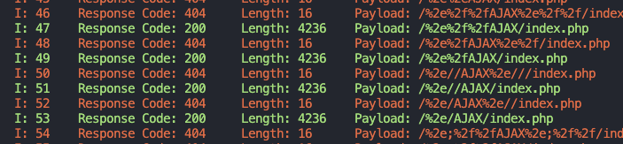
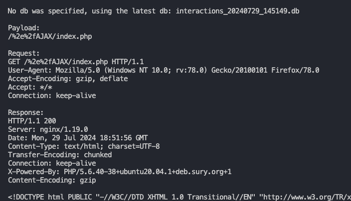
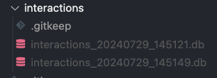

# Bypass Fuzzer
The original 403fuzzer.py :)

**Fuzz 401/403ing endpoints for bypasses**

Perform various checks via headers, path normalization, verbs, etc. to attempt to bypass ACL's or URL validation.
- Output the response codes and length for each request, in a nicely organized, color coded way so things are readable.
- "Smart" filter that lets you mute responses that look the same after a certain number of times.
- Feed it raw HTTP requests from Burp.

**If this tool helped get you a bounty or you'd just like to buy me a beer:**  
[](https://ko-fi.com/O5O3ZVDGN)  
**Follow me on twitter! @intrudir**  

### Linux & Mac OS
```bash
# clone the repo (or download it as a zip!) then navigate to the directory
git clone https://github.com/NetSPI/BypassFuzzer.git
cd BypassFuzzer

# it is best practice to create a new virtual env. 
python3 -m venv .venv

# activate the venv
source .venv/bin/activate

# install dependencies
python3 -m pip install -r requirements.txt
```

### Windows
```bash
# clone the repo (or download it as a zip!) then navigate to the directory
# if you download the .zip, remember to extract it first
cd BypassFuzzer-main\

# it is best practice to create a new virtual env. 
py -m venv .venv

# activate the venv
.venv\Scripts\activate

# install dependencies
# you need to use 'python' cmd in order to use the interpreter from this environment.
python -m pip install -r .\requirements.txt
```

For Windows, in order to use the script, make sure you use the `python` command. This ensures you are using the virtual environment.

---
# Usage
See the help menu
```bash
bypassfuzzer.py -h
```
## Specifying a request
### Best method: Feed it a raw HTTP request from Burp!
Simply paste the request into a file and run the script!  
- It will parse and use `cookies` & `headers` from the request.
- Easiest way to authenticate for your requests
```bash
python3 bypassfuzzer.py -r request.txt
```


### Using the flags
**Specify a URL**
```bash
python3 bypassfuzzer.py -u http://example.com/test1/test2/test3/forbidden.html
```

**Specify cookies to use in requests:**  
some examples:
```bash
--cookies "cookie1=blah"
-c "cookie1=blah; cookie2=blah"
```

**Specify a method/verb and body data to send**
```bash
bypassfuzzer.py -u https://example.com/forbidden -m POST -d "param1=blah&param2=blah2"
bypassfuzzer.py -u https://example.com/forbidden -m PUT -d "param1=blah&param2=blah2"
```

**Specify custom headers to use with every request**
Maybe you need to add some kind of auth header like `Authorization: bearer <token>`

Specify `-H "header: value"` for each additional header you'd like to add:
```bash
bypassfuzzer.py -u https://example.com/forbidden -H "Some-Header: blah" -H "Authorization: Bearer 1234567"
```

## Smart filter feature!
Based on response code and length. If it sees a response 8 times or more it will automatically mute it.

Repeats are changeable in the code until I add an option to specify it in flag

**NOTE: Can't be used simultaneously with `-hc` or `-hl` (yet)**

```bash
# toggle smart filter on
bypassfuzzer.py -u https://example.com/forbidden --smart
```

## Specify a proxy to use
Useful if you wanna proxy through Burp
```bash
bypassfuzzer.py -u https://example.com/forbidden --proxy http://127.0.0.1:8080
```

## Skip sending specific payload types
```bash
# skip sending header payloads
bypassfuzzer.py -u https://example.com/forbidden -sh
# or --skip-headers

# Skip sending path normailization payloads
bypassfuzzer.py -u https://example.com/forbidden -su
# or --skip-urls
```

## Hide response code/length
Provide comma delimited lists without spaces.
Examples:
```bash
# Hide response codes
bypassfuzzer.py -u https://example.com/forbidden -hc 403,404,400  

# Hide response lengths of 638
bypassfuzzer.py -u https://example.com/forbidden -hl 638  
```

## Display request / response pair that returned 200 OK
Every successful (200 OK) request & response pair gets saved to a sqlite database.  
Every payload includes an index number for easy querying.  


Once the attack is over, inspect your results and determine the index or payload of the data you'd like to see.  
You must use BOTH of the following flags:
- `--display-by` index or payload
- `--display-interactions` index number or payload string in quotes
```bash
# display by index number
bypassfuzzer.py --display-by index --display-interactions 49

# display by payload
bypassfuzzer.py --display-by payload --display-interactions "/%2e%2fAJAX/index.php"
```

Result:  


For simplicity's sake, every time you run the tool, a fresh db is created.
You can query a specific db via the `--idb` flag.  

NOTE: 
- the db needs to be inside the `interactions` dir to be useable.
- If no db is specified via `--idb`, the newest one will be used by default.

```bash
bypassfuzzer.py --display-by index --display-interactions 49 --idb interactions_20240729_145149.db
```



## Check for OOB / Blind SSRF pingback
Provide the `--oob` flag with your collaborator or ISH domain
You need to check for pingbacks yourself as I currently have no way of doing that for you.
```bash
--oob abc123.oastify.com
```

# TODO
- [ ] Add HTTP/2 support
- [ ] Looking for ideas. Ping me on twitter! @intrudir
